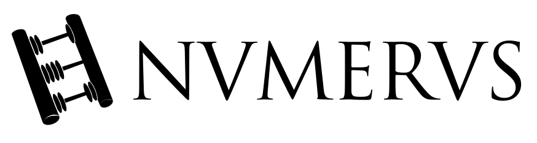

Numerus is a comprehensive C library that allows conversion and manipulation of 
roman numerals - now with it's own shell.

- [GitHub repository](https://github.com/TheMatjaz/Numerus/)
- [Web documentation](http://thematjaz.github.io/Numerus/)


What is this?
----------------------------------------

Roman numerals are the numeric system used in ancient Rome based on 
combinations of letters from the Latin alphabet to signify values. 
[Wikipedia](https://en.wikipedia.org/wiki/Roman_numerals) has a nice article on
them.

This library allows you to **convert roman numerals to values and values to 
roman numerals**, adds some extensions to them to **support big and float 
values** that other converters of the same kind usually don't, focalizes on 
**optimization, clean code and error handling**. Also offers a **Numerus 
shell** to convert values on-the-fly or by pipelining (on Unix-like OS) without
the need to incorporate the library in an existing project.

For a shorter explanation on how roman numerals works in Numerus and what
Numerus supports, check the
[Numerus syntax page](http://thematjaz.github.io/Numerus/md_SYNTAX.html).


Download, compile and use
----------------------------------------
 
### 1. Download
 
[Download](https://github.com/TheMatjaz/Numerus/releases) a zip/tarball of
the library and unpack it or clone the repository. On a Unix-like OS, you can 
also use the command line with:

```sh
# Wget users
wget -qO - https://github.com/TheMatjaz/Numerus/archive/v2.0.0.tar.gz | tar -zx ; cd Numerus-*

# Curl users
curl -fsSL https://github.com/TheMatjaz/Numerus/archive/v2.0.0.tar.gz | tar -zx ; cd Numerus-*

# Git users
git clone https://github.com/TheMatjaz/Numerus ; cd Numerus
```


### 2a. Using the Numerus CLI

Then, if you desire to just use Numerus directly with its build-in command line
interface (CLI) without incorporating it into an existing project, compile it 
with [`cmake`](http://cmake.org/) and run it. On a Unix-like OS, do it with the
following one-liner in the Numerus root folder:

```sh
# Creates a `bin` directory, builds Numerus into it and runs it
mkdir -p bin ; cd bin ; cmake .. ; make ; ./numerus ; cd -
```

- _Hint 1:_ type the `help` command in the CLI for assistance
- _Hint 2:_ check the
[Numerus syntax page](http://thematjaz.github.io/Numerus/md_SYNTAX.html) for
some rules on how to write roman numerals.


### 2b. Using Numerus in your project

To use it as a library, add it to your project, include the
[Numerus header file](http://thematjaz.github.io/Numerus/numerus_8h.html) and
you're good to go!

```C
#include "numerus.h"
```

You'll probably need the **conversion functions**: those are the first 6 
functions in the
[Numerus header file](http://thematjaz.github.io/Numerus/numerus_8h.html). 
Check the
[Numerus usage examples](http://thematjaz.github.io/Numerus/md_USAGE_EXAMPLES.html)
for a quick tutorial on how to use Numerus and the
[Numerus syntax page](http://thematjaz.github.io/Numerus/md_SYNTAX.html) for
rules on how to write roman numerals and why Numerus uses some strange names
such as _long numeral_. Everything else, including functions, parameters, 
constant and
[**error codes**](http://thematjaz.github.io/Numerus/numerus__error__codes_8h.html)
is explained in the 
[web documentation](http://thematjaz.github.io/Numerus/)
(thanks [Doxygen](http://www.doxygen.org)!).


What's the point of this library?
----------------------------------------

Nobody is probably going to need YET another roman numerals conversion tool.
Numerus was created:

- mostly for fun,
- as a coding exercise,
- to learnin how to create clean code,
- to learn C
- to be able to optimize code,
- to understand what a good in-code and web documentation is and how to write
  it with Doxygen,
- to get better at using _git_ and _GitHub_.


License
----------------------------------------

Numerus is released under the 
[BSD 3-clause license](http://thematjaz.github.io/Numerus/md_LICENSE.html) which
basically allows you to do anything with it as long as you credit the original
author (more or less).


Credits and thanks
----------------------------------------

Matjaž Guštin <dev@matjaz.it> [matjaz.it](http://matjaz.it). For **any**
suggestions please contact me.

Numerus is a port of my (not-really-as-complete-as-this-one but functioning)
project [with the same name](https://github.com/TheMatjaz/jNumerus) in Java.

The inspirations for the conversion functions were:

 - http://stackoverflow.com/a/26723344/5292928
 - http://stackoverflow.com/a/30816418/5292928
 
The [SQLite3 library](http://sqlite.org/) offered many ideas on keeping the
code clean and creating a nice API.
